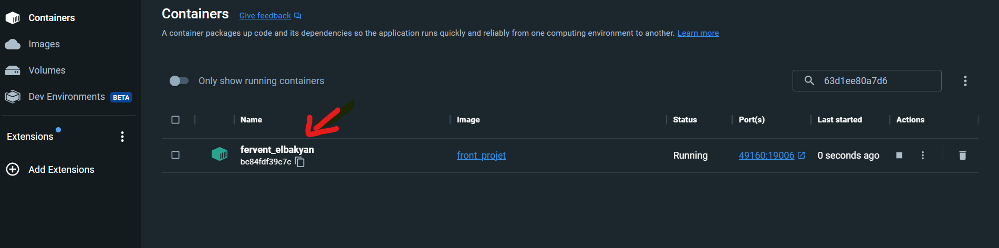
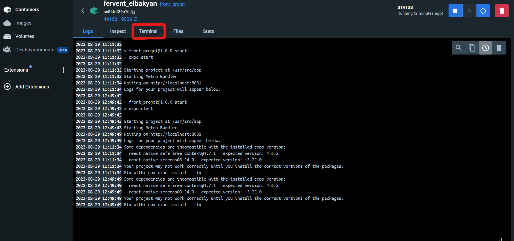
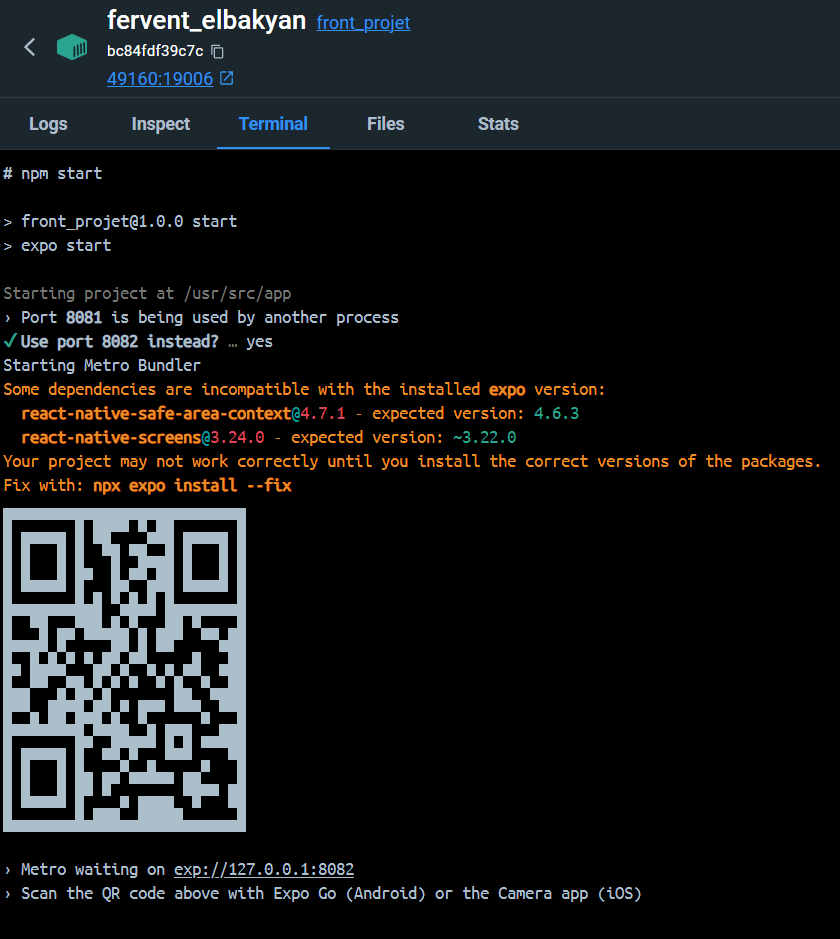
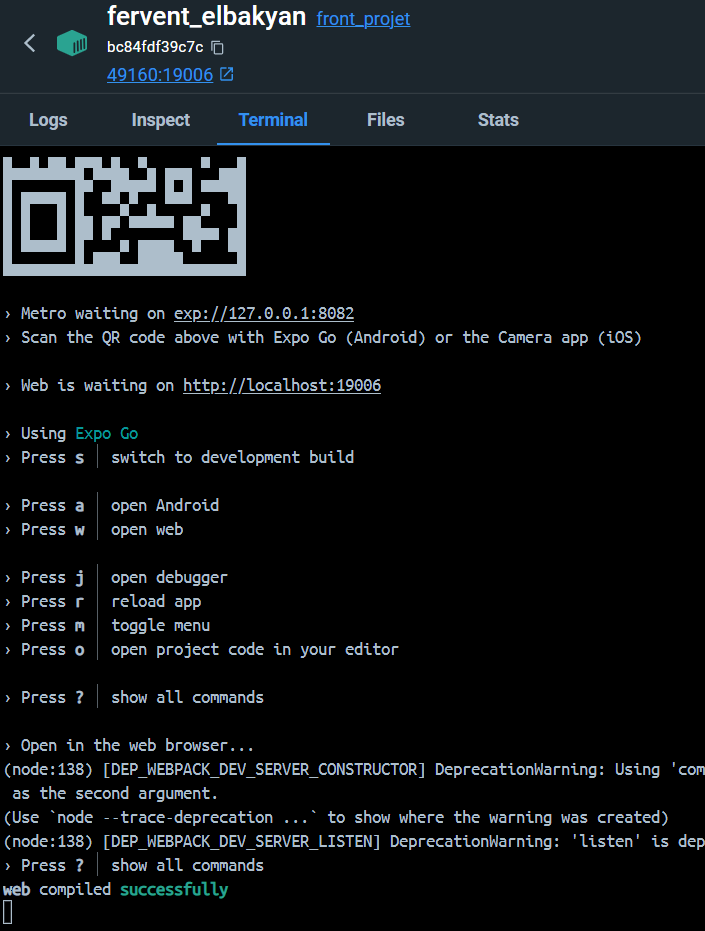
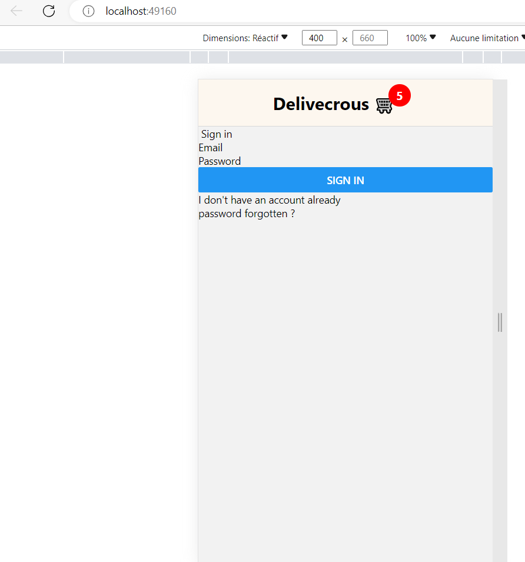

# Delivecrous - Front

Voici la partie visuel d'une application mobile réalisé en react-native d'une application ressemblant ubereat.

## Table des Matières

- [Prérequis](#prérequis)
- [Installation](#installation)
- [Installation avec docker](#installation)
- [Utilisation](#utilisation)
- [Contribuer](#contribuer)
- [Licence](#licence)


## Prérequis

Pour pouvoir lancer le projet il faut d'abord télécharger la dernière version de node.js : https://nodejs.org/fr
la version recommandé pour la plupart des utilisateurs est à l'heure où j'édite ce readme : 18.17.1.LTS

Pour vérifier que l’installation s’est bien passée, vous pouvez ouvrir votre Terminal ou Invite de commande et taper node -v qui devrait vous renvoyer la version de Node.js installée et npm -v qui devrait vous renvoyer la version de npm installée.

## Installation

```bash
# Clonez le référentiel
git clone https://github.com/theoernould/projet-rentree-front.git

# Accédez au répertoire du projet
cd projet-rentree-front

# Installez les dépendances
npm install

# lancer le projet
npm start

# lancer dans une application web
w

```

## Installation avec docker

### Installer docker

Afin de lancer notre front avec docker il faut déjà le télécharger et l'installer.
voici les liens des guides pour [windows](https://docs.docker.com/desktop/install/windows-install/), [mac](https://docs.docker.com/desktop/install/mac-install/), [linux](https://docs.docker.com/desktop/install/linux-install/).

### Installer le projet 

- lancer un terminal dans un répertoire

```bash

# télécharger les fichiers du projet
git clone https://github.com/theoernould/projet-rentree-front.git

# aller dans le répertoire du projet
cd projet-rentree-front

```

### créer l'image docker

```bash

#installe l'image
docker build . -t front_projet

#lance un conteiner de l'image, redirige le port 19006 de la machine docker au port de votre machine 49160
docker run -p 19006:19006 -d front_projet

```

Vous pourez ensuite aller sur docker hub et cliquer sur le conteiner qui a un nom aléatoire. Mais vous pourrez voir que l'image se nomme bien "front_projet"



Vous verrez plusieurs cliquer sur l'onglet "terminal"




Vous pourrez ensuite faire les commandes suivantes dans le terminal

```bash
# lancer le projet
npm start

# lancer dans une application web
w
```





Vous pourrez aller sur le port [49160](http://localhost:49160/) pour aller voir notre belle application :D


